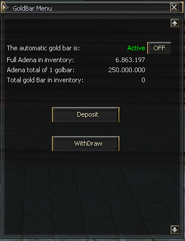

# AutoBanking.ext

Extersion for automatic banking in the lucera2.

## HTML edit

Edit the file `data/html[en/ru]/scripts/services/banking/autobanking.htm` to change the text of the page.

## Installation

Copy the file `AutoBanking.ext.jar` to the folder libs.

## Bypass

`bypass -h user_autogoldbar` - Enable/Disable auto banking (autogoldbar).

## Configuration

* Copy the file `AutoBanking.properties` to the folder config/custom in the game server folder.
* Copy variables from file `extra/strings.properties` to file `data/string/strings_[en/ru].properties` in the game server folder.

## Usage

The extension is activated by default. To disable it, set the property `AutoBankingEnable` to `false`.

## Comands in game:

* `.autobanking` - Enable/Disable auto banking (autogoldbar).
* `.autogoldbar` - Enable/Disable auto banking (autogoldbar).
* `.golbar` - show htm page.
* `.deposit` - (overwrite) Exchange adena for Item defined in AutoBanking.properties.
* `.withdraw` - (overwrite) Exchange item defined in AutoBanking.properties for Adena.

All commands can be used by GMs and players.

## Authors

* **[Weltongbi](https://github.com/weltongbi/)** - *Initial work*

## License

This project is licensed under the MIT License - see the [LICENSE](LICENSE) file for details
